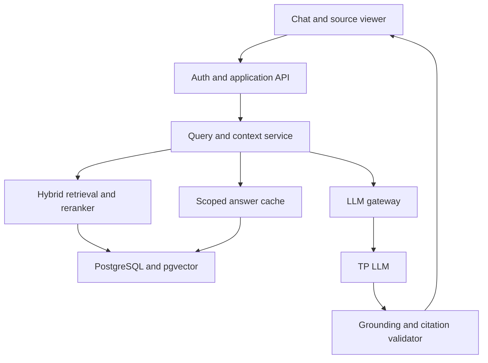

# Product Requirements Document: Governed Knowledge Assistant with TP LLM

**Version:** 1.0  
**Date:** 17 September 2026  
**Status:** Draft for product and engineering review  
**Owner:** Product team  
**Decision recorded:** TP LLM is the selected generation service.

## 1. Executive summary

Build a governed enterprise knowledge assistant for regulated business users. It answers questions over approved RBI, SEBI, IRDAI and internal documents, shows verifiable source passages, respects document permissions and effective dates, and remembers user context under explicit controls. It uses **TP LLM for generation**. The product owns the conversation, knowledge, security, retrieval, memory, citation, caching and evaluation layers.

The initial release prioritizes answer quality and traceability. Token savings come from selective retrieval, context budgeting, summaries, safe answer caching and, **only if TP LLM supports it**, provider-side prompt or prefix caching.

## 2. Problem and Day 1 observations

| Observation | Product response | Acceptance example |
|---|---|---|
| Indentation and grammar vary | Response Composer and Markdown checks | Nested lists and prose render correctly. |
| Each point is too long | Short bullet policy | Answer contains concise, complete points. |
| Answers need more coverage | Dynamic depth | More short points where the question warrants them. |
| “from S4” appears in user text | Citation resolver | Show document title, page and passage, never internal IDs. |
| Response detail is uneven | Intent-aware templates | A short lookup stays short; a comparison covers each dimension. |
| Users need their own chat history | Conversation service | History is private by default and resumable. |
| Feedback lacks a clear improvement loop | Feedback and evaluation | Negative feedback enters classified review. |
| Token use may rise with history and RAG | Context budget, caches | Track tokens per answered query and calls avoided. |

These are product requirements, not merely prompt tweaks.

## 3. Goals and boundaries

### Goals

1. Give accurate, readable answers grounded in authorized source versions.
2. Let users verify claims by opening and highlighting source passages.
3. Maintain user-specific conversation continuity and controlled memory.
4. Support regulator, date, department and document filters.
5. Provide an operational view of ingestion, failures, quality and consumption.
6. Reduce repeated TP LLM calls without returning stale or unauthorized answers.

### Release boundaries

- Initial scope: question answering, knowledge discovery and document analysis. No autonomous changes to enterprise systems.
- TP LLM is the generation service. Its hosting location, API contract, data handling, limits and caching support require integration discovery.
- Embeddings and reranking have independent adapters; provider and model selection remain implementation decisions.
- The application must not assume TP LLM provides embeddings, moderation, prompt caching or a particular context length.
- Personalized memory is introduced only after conversation storage and privacy controls are proven.

## 4. Users and jobs

| User | Main job | Required controls |
|---|---|---|
| Business employee | Find current requirements and policy guidance | Plain language, filters, citations, private history. |
| Compliance or risk analyst | Compare rules and inspect historical versions | Date-aware search, document lineage, exportable references. |
| Knowledge curator | Publish and correct source content | Ingestion queue, metadata, effective dates, approvals. |
| Tenant administrator | Manage access and settings | SSO groups, ACLs, theme, retention, model policy. |
| Quality reviewer | Diagnose bad answers | Traces, benchmark runs, feedback classification. |

## 5. User experience

### 5.1 Chat and history

- A familiar chat interface supports streaming, stop/regenerate, conversation titles, search and resume.
- The sidebar shows only the user's permitted conversations, sorted by recency.
- Users can delete a conversation subject to retention and legal-hold policy.
- A conversation may bind to a workspace and explicit document/filter scope.
- New questions display the active regulator, date and source filters before submission.
- A follow-up inherits the active scope unless the user changes it explicitly.
- Suggested follow-ups and speech input are later enhancements.

### 5.2 Answer style

- Lead with a direct answer, then use short bullets or a compact table when useful.
- Each bullet should contain one idea; increase bullet count to improve coverage.
- Use grammatical indentation and valid Markdown. Avoid deep nesting.
- Distinguish a sourced fact, a synthesis and an uncertainty.
- A source reference shows **document title · version/effective date · page/section**.
- Never display `S4`, chunk IDs, vector scores, raw prompts or internal reasoning to business users.
- If approved evidence is insufficient, say so and suggest a narrower query or authorized source.

### 5.3 Citation interaction

Clicking a citation opens the source viewer at the page or section and highlights the supporting passage. A citation must remain bound to the exact document version and passage used for that answer. If the file cannot be shown, explain that access is unavailable rather than linking to a different version.

### 5.4 Feedback

Every answer supports positive/negative feedback. Negative feedback can specify incorrect, incomplete, wrong source, outdated, too long, too short, wrong regulator or unclear. A correction is review material; it does not automatically modify knowledge, prompts, cache or model weights.

## 6. Functional requirements

Priority labels: **M** = initial release; **S** = next release; **C** = optional.

| ID | Priority | Requirement | Acceptance criterion |
|---|---|---|---|
| FR-01 | M | Enterprise SSO and scoped RBAC | Authenticated identity resolves tenant, user and groups. |
| FR-02 | M | Private chat history | Users cannot retrieve another user's history without explicit sharing. |
| FR-03 | M | TP LLM generation through a gateway | All generation goes through one audited adapter. |
| FR-04 | M | Hybrid retrieval | Keyword and vector results are merged and reranked. |
| FR-05 | M | Permission-aware search | Unauthorized chunks are excluded before model input and cache return. |
| FR-06 | M | Regulator, type and date filters | Filters apply across keyword, vector and cache paths. |
| FR-07 | M | Version and effective-date handling | Current queries exclude superseded sources; historical queries use applicable versions. |
| FR-08 | M | Verified citations | Each displayed reference resolves to an authorized source passage. |
| FR-09 | M | Source viewer and highlight | Citation opens the exact version near its cited passage. |
| FR-10 | M | Consistent concise formatting | Response checks reject malformed lists and exposed internal markers. |
| FR-11 | M | Governed ingestion and MIS | Curators see daily counts, status and failure reasons. |
| FR-12 | M | User feedback and traceability | Each feedback item links to answer, sources and prompt/model versions. |
| FR-13 | M | Evaluation harness | Curated cases cover retrieval, citation, security and groundedness. |
| FR-14 | M | Tenant and role isolation | Automated probes show zero cross-boundary retrievals. |
| FR-15 | M | Token budget controller | Prompt has configurable allocations and output reserve. |
| FR-16 | S | Exact and safe semantic answer cache | Cache revalidates scope, versions, permissions and citations. |
| FR-17 | S | Conversation summaries | Long threads preserve relevant context within budget. |
| FR-18 | S | Long-term personal memory | Memory has scope, provenance, conflict handling and user controls. |
| FR-19 | S | User document upload | Temporary and managed modes have different visibility and retention. |
| FR-20 | S | Document catalogue | Users browse only entitled documents and versions. |
| FR-21 | S | Canonical FAQ approval and pre-warming | One approved answer may have several bounded question aliases. |
| FR-22 | S | Retrieval-result cache | Cached candidates are rechecked for ACL and version freshness. |
| FR-23 | C | Speech input | Audio transcribed under tenant-approved processing policy. |
| FR-24 | C | Advanced branding and sharing | Tenant themes and explicit conversation sharing. |

**Release reconciliation:** FR-16 is Should Have, so production readiness does not require semantic caching unless it is enabled for that deployment. When enabled, the cache safety criteria in this PRD become mandatory.

## 7. Knowledge and ingestion

### 7.1 Source lifecycle

`Receive → validate file and scan → parse → extract structure/metadata → curate → chunk → embed → index → quality check → publish`

Documents enter search only after publication. Ingestion retries are idempotent. Failed documents remain visible to curators with an actionable reason. Superseding a document triggers index and cache invalidation. Retain original bytes and extraction metadata so passages can be traced back to the source.

### 7.2 Required metadata

`tenant_id`, `document_id`, `version_id`, `title`, `document_type`, `regulator`, `business_unit`, `jurisdiction`, `topic`, `effective_from`, `effective_until`, `publication_date`, `status`, `confidentiality`, `ACL`, `source_uri` and `content_hash`.

Status values include `draft`, `active`, `superseded`, `withdrawn` and `archived`. A chunk records page, heading, paragraph, source offsets or bounding boxes, extracted text, parser version and document-version ID. Tables should preserve headers and row relationships; images/scans may need OCR and quality review.

### 7.3 Ingestion MIS

The admin screen shows received, processing, successful, failed and pending counts by day; source; regulator; type; effective date; version; chunks; duration; and error reason. Curators can inspect, retry, correct metadata and publish according to role. Re-ingestion must not silently create duplicate active versions.

## 8. Retrieval and answers

### 8.1 Query flow

1. Authenticate user and resolve tenant, groups and conversation scope.
2. Interpret intent, regulator, effective date and requested answer depth.
3. Apply tenant, ACL, validity and user-selected filters.
4. Check eligible exact/canonical/semantic answer cache entries, if enabled.
5. Run full-text and vector search under the same security filters.
6. Merge and rerank; deduplicate overlapping passages.
7. Build a bounded context from evidence, recent chat and relevant memory.
8. Generate through the TP LLM gateway.
9. Validate claim support and citation mapping; format the response.
10. Record trace and usage; cache only if the answer qualifies.

The system must retrieve again or abstain when cached provenance cannot be checked. For a time-specific question, filter to versions effective at that time. Conflicting active sources should be identified and shown for review rather than blended into a single false answer.

### 8.2 Evidence and citation record

```json
{
  "tenant_id": "tenant-1",
  "document_id": "doc-23",
  "document_version_id": "v3",
  "title": "Policy title",
  "regulator": "RBI",
  "effective_from": "2026-04-01",
  "page": 42,
  "section": "Records",
  "chunk_id": "chunk-42-3",
  "source_offsets": { "start": 902, "end": 1128 },
  "text": "Supporting passage..."
}
```

The `chunk_id` is internal. The visible citation is assembled from document metadata. Store answer-to-claim-to-passage relationships, and recheck viewer authorization on every open.

### 8.3 Answer validation

For a high-risk regulatory response, extract material claims and check each against retrieved evidence. Require correct regulator, effective date, document version and passage. If checks fail, regenerate once with corrected evidence or return a qualified abstention. A model-based validator alone is insufficient for enforcing ACL or version rules.

## 9. Conversations and personalized context

### 9.1 Context Builder

Input: tenant, user, groups, workspace, conversation, current question and active filters. Output: policy instructions, minimal relevant profile, recent turns, approved summary, selected memories and authorized RAG passages. Evidence takes priority over a memory of an earlier answer.

### 9.2 Memory policy

Memory types: preference, fact, decision, goal, relationship, project context and user instruction. Each entry records scope (`user`, `workspace`, `conversation` or temporary), provenance, confidence, creation/update dates, retention, status and access controls. A contradiction supersedes the old entry with an audit trail. Users can inspect and correct personal memories when this feature ships. Do not silently convert retrieved documents or third-party assertions into personal memory.

### 9.3 Token allocation

Reserve capacity for system policy, current question, response and citation formatting. Then allocate evidence, recent turns, summary and relevant memory according to query type. Drop duplicate or weak context. Log requested and admitted token counts; never concatenate the full transcript and all retrieved chunks by default.

## 10. TP LLM integration

### 10.1 Gateway contract

Implement `generate`, `stream`, `count_tokens_or_estimate`, `model_info`, `health` and normalized error handling. Include tenant/request trace IDs, timeout, retries only where safe, usage accounting and policy-controlled parameters. Embeddings are a separate interface; add `embed` to the TP adapter only if an approved TP embedding service is actually available.

### 10.2 Integration discovery checklist

Confirm with TP LLM: API protocol; auth; deployment and data residency; retention/training policy; model IDs and versions; context limit; tokenizer or token estimates; streaming; structured output; input/output limits; concurrency/rate limits; error taxonomy; failover; SLA; usage reporting; and provider-side prompt/prefix cache support. Do not claim a fixed token saving or latency before benchmarking the chosen deployment.

### 10.3 Prompt caching distinction

- **Answer cache:** May avoid a TP LLM call after full eligibility and citation checks.
- **Retrieval cache:** Avoids repeated retrieval work; answer can still be regenerated.
- **Provider prompt/prefix cache:** Reuses inference work only if TP LLM implements it. A client-side string cache cannot reproduce a provider's KV cache.
- **Prompt reduction:** Summaries, deduplication and evidence selection lower the submitted tokens even without provider caching.

For provider caching, keep stable system and tenant instructions in a common prefix only when doing so respects tenant isolation and TP's cache guarantees. Measure actual cached tokens, latency and charges if TP exposes them.

## 11. Safe semantic answer cache

### 11.1 Eligibility and identity

Use PostgreSQL + pgvector initially. A cache entry binds the normalized intent and embedding to tenant, entitlement scope fingerprint, regulator, business unit, date interval, document-scope fingerprint, source version IDs, prompt version, model version, language and answer-format policy. Include passage provenance and expiry.

A high similarity score such as `0.96` is only a calibration starting point. Require an intent/constraint check that distinguishes, for example, “current retention” from “retention in 2024” and “may” from “must.” The threshold is tuned against false-positive test cases.

### 11.2 Hit-time checks

Before returning a hit, verify current identity and ACL, tenant, requested filters, source status/effective dates, exact source versions, citation availability, response policy and expiry. Disable hits when the user depends materially on earlier chat, personal memory, a temporary upload, rapidly changing facts or low-confidence sources. A cache hit gets its own trace and feedback link.

### 11.3 Invalidation and pre-warming

Document publish/supersede/withdraw events invalidate dependent entries using source-version IDs, not TTL alone. Prompt/model policy changes can invalidate or segregate entries. Pre-warm a limited set of SME-approved canonical FAQs from important sections. Store one approved answer with bounded aliases; test variants for same intent and constraints. Cluster real, repeated questions to propose future FAQs. Generated aliases never become approved solely because they sound similar.

## 12. Security, privacy and governance

- Enforce tenant ownership on conversations, messages, memories, documents, chunks, feedback and caches. Use database row-level policies or an equivalent defense in depth where practical.
- Apply document ACLs before model context construction and again on citation open and cached-answer return.
- Encrypt transport and stored sensitive data; use enterprise secrets management and audit privileged changes.
- Separate user, curator, administrator and quality-review permissions.
- Treat document text and uploaded files as untrusted; retrieved instructions cannot override application policy.
- Validate upload MIME, size, malware status, owner, classification and retention before parsing.
- Mask sensitive trace content and restrict trace access; define data retention and deletion by tenant policy.
- Verify TP LLM data location, retention and training commitments before production use.
- Never show chain-of-thought, raw prompts, similarity scores or internal chunk markers in the business UI.

## 13. Architecture and data model



An independent ingestion worker parses documents, validates metadata and versions, writes source files to object storage and publishes chunks to search. Evaluation and telemetry observe every path. Frontend code may be adapted from LibreChat after a spike; the application APIs and domain logic remain product-owned.

Core entities: tenant, user, group, conversation, message, summary, memory, memory_history, document, document_version, document_acl, chunk, embedding, citation, canonical_question, alias, approved_answer, semantic_cache, retrieval_cache, feedback, evaluation_run, prompt_version, model_config, query_trace and audit_event.

## 14. Admin and operational views

| View | Key actions and measures |
|---|---|
| Content MIS | Ingestion status, errors, version lineage, retry and publish. |
| Document catalogue | Filter, inspect metadata, permissions and effective dates. |
| Quality dashboard | Benchmark results, failures, unsupported claims, wrong citations. |
| Consumption dashboard | TP calls, tokens, latency, cache hits, avoided calls. |
| Security audit | Group changes, document access, cache invalidation, exports. |
| Tenant settings | Branding, defaults, retention, quotas and feature flags. |

## 15. Metrics and evaluation

### Retrieval and answer quality

Measure context recall/precision on labeled cases, ranking quality, no-result rate, wrong-regulator and expired-document retrieval; answer correctness, faithfulness, claim support, citation correctness/completeness and abstention quality. Maintain a human-curated gold set with simple facts, comparisons, historical rules, conflicts, no-answer cases, adversarial documents and follow-ups.

### Performance and consumption

Track P50/P95 latency, first token, TP requests/errors/timeouts, input/output/context tokens, tokens per query/user/collection, cache eligibility/hits/false hits, avoided model calls, invalidation delay and ingestion throughput. Track savings against a no-cache baseline with equivalent answers, not just raw hit rate.

### Initial launch gates

- Zero known cross-tenant or unauthorized retrieval/cache exposures.
- Every displayed citation resolves to an authorized, correct document version.
- Citation correctness target: at least 95% on an agreed labeled evaluation set; investigate every material failure.
- Formatting, filter and effective-date scenarios pass signed-off tests.
- Latency and answer-quality thresholds are agreed after benchmarking TP LLM on production-like hardware and corpus.
- If semantic caching is enabled, false-hit and stale-source tests pass before rollout.

Ragas is a candidate evaluation library. Human review remains the authority for high-risk gold cases; model-judged metrics require calibration.

## 16. Delivery plan

| Phase | Deliverable | Exit condition |
|---|---|---|
| 0. Discovery and benchmark | TP contract, corpus inventory, UI spike, license/dependency review, gold set | Architecture and baseline performance approved. |
| 1. Governed foundation | SSO, private history, ingestion, ACL hybrid retrieval, filters, citations, viewer, formatting, admin MIS | Initial release gates pass without answer cache. |
| 2. Quality | Reranking tuning, claim checks, feedback, traces, evaluation dashboard | Quality regressions visible and triaged. |
| 3. Context | Summaries, relevant history, controlled memory | User scope and conflict tests pass. |
| 4. Optimization | Exact/semantic/retrieval cache, curated FAQ, conditional TP prompt cache | False-hit tests and measured savings pass. |
| 5. Expansion | Uploads, catalogue, speech, advanced branding/sharing | Each feature passes tenant/privacy review. |

Workstreams: UX, ingestion/retrieval, context/memory, TP integration, security, evaluation/operations. They can proceed concurrently where interfaces are defined, but release gates are sequential.

## 17. Open-source acceleration and licensing check

The table describes **candidate use**, not a commitment to fork. Verify the pinned revision, subdirectories, assets, model weights and transitive dependencies before redistribution.

| Component | Intended use | Current repository license position | Decision |
|---|---|---|---|
| [LibreChat](https://github.com/danny-avila/LibreChat/blob/main/LICENSE) | UX and conversation spike | MIT | First UI candidate; integration spike required. |
| [AnythingLLM](https://github.com/Mintplex-Labs/anything-llm/blob/master/LICENSE) | POC/reference | MIT repository license | Evaluate as alternative. |
| [Onyx](https://github.com/onyx-dot-app/onyx/blob/main/LICENSE) | Search/connector patterns | Core and `ee` terms differ | Study selectively; inspect exact files. |
| [Docling](https://github.com/docling-project/docling/blob/main/LICENSE) | Structured extraction | MIT repository license | Preferred parser candidate; check models. |
| [Haystack](https://github.com/deepset-ai/haystack/blob/main/LICENSE) | Explicit RAG components | Apache 2.0 | Evaluate against a thin custom pipeline. |
| [pgvector](https://github.com/pgvector/pgvector/blob/master/LICENSE) | Vectors and cache | PostgreSQL-style license | Initial vector option. |
| [PDF.js](https://github.com/mozilla/pdf.js/blob/master/LICENSE) | Citation viewer | Apache 2.0 | Preferred viewer candidate. |
| [Langfuse](https://github.com/langfuse/langfuse/blob/main/LICENSE) | Tracing/evaluation | Core MIT; `ee` separately licensed | Evaluate core only. |
| [Ragas](https://github.com/vibrantlabsai/ragas/blob/main/LICENSE) | Offline RAG evaluation | Check pinned release and dependencies | Candidate. |
| [Whisper](https://github.com/openai/whisper/blob/main/LICENSE) | Optional speech input | MIT code | Later phase; review model weights/dependencies. |

[Open WebUI's current license](https://github.com/open-webui/open-webui/blob/main/LICENSE) restricts changing its branding for deployments above a specified user threshold without permission or an enterprise license. It is therefore not the default white-label foundation. TP LLM replaces the earlier vLLM serving recommendation entirely; no vLLM runtime is part of the baseline stack.

## 18. Risks, dependencies and decisions

| Item | Why it matters | Next action |
|---|---|---|
| TP LLM capabilities unknown | Tokenizer, streaming, cache and context limits affect design | Run adapter proof of concept and document supported features. |
| Corpus quality | OCR, tables and metadata can damage citations | Sample representative files and score extraction. |
| Effective-date ambiguity | Historical answers can cite current rules | Curate version lineage and test date queries. |
| Semantic false hits | Similar questions can have opposite legal meaning | Use constraint checks, SME cases and staged rollout. |
| UI fork integration effort | Full-product forks may carry backend assumptions | Time-box a LibreChat UX integration spike. |
| Cost estimates | TP pricing/throughput are not specified | Benchmark real usage and document a cost model. |

Decisions still needed: target deployment and data residency; exact TP LLM API/model and commercial terms; source systems and initial corpus; tenant/role topology; retention policy; languages; upload approval process; launch SLA and benchmark thresholds. These are discovery inputs, not blockers to the architecture described here.

## 19. Definition of done for initial release

An authorized user can sign in, resume a private chat, filter by regulator and date, ask a question, read a concise answer from TP LLM, inspect exact source passages, and give feedback. Curators can ingest/version documents and see failures. Quality reviewers can reproduce an answer from its trace and evaluation set. Security tests find no cross-user, cross-tenant or ACL breach. Published answers meet the agreed accuracy, citation, formatting and latency gates.

---

**Product position:** A governed enterprise knowledge assistant with personalized context, source-grounded answers, regulatory version awareness and measured TP LLM consumption.
