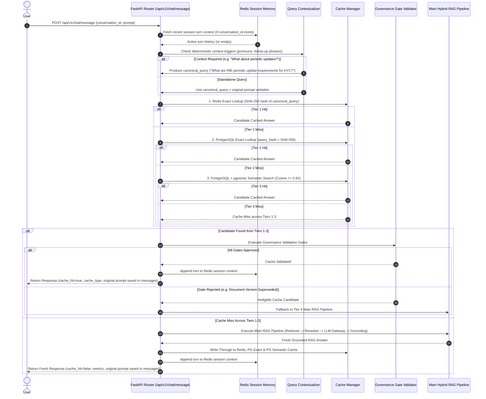

# Phase 5 — Memory + Cost-Saving Cache Implementation Plan (Implemented)

**Document Status**: Fully Implemented & Verified in Production  
**Target System**: IDFC RBI Compliance / Governed Knowledge Assistant  
**Primary Reference**: Product Requirements Document (BRD) v1.0 (17 September 2026)  
**Author**: Senior Software Architect & Senior Python/FastAPI Engineer  
**Date**: September 2026  

---

## 1. Objective

Phase 5 introduces **Session Memory** and a **4-Tier Governed Cost-Saving Cache Cascade** to the IDFC RBI Compliance Chatbot. The primary objectives are:

1. **Multi-Turn Conversation Memory**: Maintain short-term conversational context in Redis so follow-up questions (e.g., *"What about periodic updates?"*) are contextualized into canonical regulatory queries without needing full conversation re-processing.
2. **Sub-Second Latency & Token Cost Reduction**: Intercept repeated or semantically equivalent regulatory queries before calling the LLM, reducing Gemini API token costs by up to 60–80% and response times from 3–5s down to <50ms.
3. **Strict Compliance Governance & Version Safety**: Enforce explicit validation gates (tenant, user ACL, document status, effective date, citation availability) before serving any cached answer. A cached answer MUST NEVER be reused solely due to semantic or textual similarity.
4. **Automatic Version-Aware Invalidation**: Dynamically invalidate reusable cache entries when underlying RBI document versions are superseded or withdrawn, while leaving immutable user conversation histories (`messages` table) intact.

---

## 2. Current Architecture Audit

### 2.1 Reusable Components (Phase 1 – Phase 4)

- **Database Infrastructure (`app/db/session.py`)**: Async SQLAlchemy 2.0 with `asyncpg` driver for application queries and `psycopg2` sync driver for Alembic migrations.
- **Authentication & RBAC (`app/api/v1/auth.py`, `app/core/security.py`)**: JWT token verification (`get_current_user`) delivering validated `User` context (`id`, `role`, `email`) for tenant/user isolation.
- **Document & Version Models (`app/models/document.py`, `app/models/chunk.py`)**:
  - `Document` system-of-record registry.
  - `DocumentVersion` tracking `status` (`ACTIVE`, `INACTIVE`, `SUPERSEDED`), `file_hash`, and publication dates.
  - `DocumentChunk` mirroring chunks in PostgreSQL for sparse FTS retrieval.
- **True Hybrid RAG Pipeline (`app/services/rag/`)**:
  - `HybridRetriever`: Combines ChromaDB (Dense Nomic Embed v1.5) and PostgreSQL FTS (Sparse `tsvector`).
  - `BGEReranker`: Cross-encoder reranking (`BAAI/bge-reranker-v2-m3`).
  - `GeminiGenerator`: `google.genai` SDK wrapper enforcing structured Pydantic response schemas.
  - `GroundingValidator`: Validates LLM `citation_ids` against retrieved evidence chunks.
- **Embeddings Service (`app/services/embeddings/nomic_service.py`)**: `NomicEmbeddingService` generating 768-dimensional normalized embeddings for text queries and chunks.
- **Chat API & Persistence (`app/api/v1/chat.py`, `app/models/chat.py`)**:
  - Existing endpoint: `POST /api/v1/chat/message`.
  - `Conversation` and `Message` ORM models tracking chat sessions and turns.

### 2.2 Empirical Audit Discoveries & Prerequisite Requirements

1. **PostgreSQL pgvector Prerequisite (CRITICAL)**:
   - Empirical audit confirmed `pgvector` extension is **NOT currently installed** in the PostgreSQL instance (`pg_available_extensions` has no `vector` record).
   - **Requirement**: `CREATE EXTENSION IF NOT EXISTS vector;` will fail if the PostgreSQL server lacks the `pgvector` binary.
   - **Action**: Startup & migration code will check `pg_available_extensions`. If `vector` binary is missing in production, the backend will fail startup with an explicit actionable error detailing pgvector installation steps.
   - **Test Strategy**: PyTest unit/integration tests will use `fakeredis` and SQLite vector mock wrappers to remain isolated without requiring live Redis/pgvector daemons. Production will NOT silently fall back to an un-governed cache.
2. **Redis Integration**:
   - `redis` Python package is missing from `requirements.txt`. Must be added along with `pgvector` and `fakeredis`.
3. **LLM Gateway Layer**:
   - `GeminiGenerator` directly instantiates `google.genai.Client`. It will be adapted behind an `LLMGateway` abstraction (`FastAPI` → `LLM Gateway` → `TP LLM` / `Gemini`) without adding a second LLM path.

---

## 3. Phase 5 Scope

- **Redis Session Memory**: Short-term turn history storage per user session (`session:{user_id}:{conversation_id}:context`).
- **Deterministic Contextualizer**: Rule-based pronoun/reference detector; calls light LLM contextualization ONLY when context dependency is detected. Preserves original user question in `messages.content`.
- **Sequential 4-Tier Cache Cascade**:
  1. Tier 1: **Redis Exact Cache** (Hot in-memory key-value by Query SHA-256 hash).
  2. Tier 2: **PostgreSQL Exact Cache Backstop** (Persistent DB fallback by Query SHA-256 hash).
  3. Tier 3: **PostgreSQL + pgvector Semantic Cache** (Cosine similarity search over normalized query embeddings).
  4. Tier 4: **Main Hybrid RAG** (ChromaDB + PostgreSQL FTS + BGE Reranker + LLM Gateway).
- **Cache Governance Validation Gate**: Multi-gate validator checking Tenant, User ACL, Regulator, Document Version Status (`ACTIVE`), Effective Date, Expiry, and Citation Availability before returning ANY cached answer. High similarity alone NEVER produces a cache hit.
- **Version-Aware Invalidation Engine**: Listener/Service invalidating dependent reusable cache entries when an underlying `DocumentVersion` becomes `SUPERSEDED` or `INACTIVE`/`WITHDRAWN`. Historical chat records (`messages`) are NEVER deleted.
- **Question Variant Manager**: Bounded alias generation pointing to the same approved answer and provenance record.
- **Observability & Metrics**: Exposing token savings, hit/miss tier, and latencies in `messages.metrics`.

---

## 4. Non-Goals

- **No Neo4j / Knowledge Graph**: Knowledge graph retrieval is deferred to Phase 6.
- **No Parallel Cache Lookup**: Lookups are strictly sequential (Redis Exact → PG Exact → PG Semantic → Main RAG).
- **No Unrestricted Similarity Hits**: Semantic similarity alone never bypasses governance validation gates.
- **No LLM Query Rewriting for Every Turn**: Standalone queries skip LLM rewriting entirely.
- **No Deletion of Historical Conversations**: Conversation history (`messages` and `conversations` tables) remains immutable audit log data.
- **No Secondary LLM Path**: Existing Phase 4 RAG generator is preserved behind the LLM Gateway.

---

## 5. End-to-End Request Flow & Cache Architecture

### 5.1 Responsibilities Separation
- **Redis**: Volatile session turn history, hot exact response cache, version eviction index sets.
- **PostgreSQL**: Authoritative source of truth (`conversations`, `messages`), persistent exact cache backstop (`cached_answers`), `pgvector` semantic vector search, document version dependencies (`cache_document_dependencies`).

### 5.2 Sequential Request Flow (`POST /api/v1/chat/message`)



---

## 6. Session Memory & Deterministic Query Contextualization

### 6.1 Redis Key Structure & TTL
- **Key Pattern**: `session:{user_id}:{conversation_id}:context`
- **Data Structure**: Redis List (JSON elements)
- **TTL**: 3600 seconds (1 hour sliding expiration)

### 6.2 Deterministic Context-Dependency Triggering
To avoid unnecessary LLM calls on every message:
- Evaluate input prompt with light regex/heuristic rules:
  - Pronouns: `it`, `they`, `these`, `those`, `this`, `that`, `same`.
  - Follow-up phrases: `what about`, `how regarding`, `any update on`, `does this apply to`, `is it required`.
  - Short queries (< 6 words) without explicit RBI regulatory terms.
- **Rule**:
  - If NO context trigger is matched, the query is treated as **standalone** (`canonical_query = prompt`) and skips LLM contextualization entirely.
  - If context trigger IS matched, a lightweight prompt rewrites the query using recent session context into a single `canonical_query`.
  - The original user query is ALWAYS saved verbatim in `messages.content` (role=USER). User messages are NEVER overwritten.

---

## 7. 4-Tier Sequential Cache & Governance Validation

### 7.1 Tier Sequence
1. **Tier 1 (Redis Exact)**: In-Memory Key-Value (`exact_cache:{sha256_hash}`). TTL: 24 hours.
2. **Tier 2 (PostgreSQL Exact Backstop)**: Query `cached_answers WHERE query_hash = :hash AND is_active = TRUE AND expires_at > NOW()`. On hit, write-through to Tier 1.
3. **Tier 3 (PostgreSQL + pgvector Semantic)**: Cosine similarity search (`query_vector vector_cosine_ops >= 0.92`). On hit, write-through to Tier 1.
4. **Tier 4 (Main Hybrid RAG Pipeline)**: Dense + Sparse Retrieval → BGE Reranker → LLM Gateway → Grounding Validation.

### 7.2 Governance Validation Pipeline
Candidates from Tiers 1–3 MUST pass all validation gates before being served:

```
[Cache Candidate Surfaced]
          │
          ▼
 Gate 1: Check System Status & Expiry (is_active == True AND expires_at > NOW())
          │ PASS
          ▼
 Gate 2: Check Tenant & User ACL (tenant_id == 'idfc_bank' AND user.role >= candidate.required_role)
          │ PASS
          ▼
 Gate 3: Check Cited Document Version Freshness
          SELECT status FROM document_versions WHERE id IN (cited_version_ids);
          ALL cited document versions MUST currently have status == DocumentStatus.ACTIVE!
          │ PASS
          ▼
 Gate 4: Check Regulatory Effective Dates & Scope Constraints (effective_date <= CURRENT_DATE)
          │ PASS
          ▼
[Gate Approved -> Serve Cached Answer]
```

> **Governance Principle**: High semantic similarity alone MUST NEVER produce a cache hit. If ANY gate fails, the candidate is rejected and the system falls through to Tier 4 Main RAG.

---

## 8. Provenance, Dependency Tracking & Version Invalidation

### 8.1 Full Provenance Metadata
Every cached answer record retains:
- `document_id` and `document_version_id` for every cited chunk.
- Citation source details (circular number, version number, page number).
- `original_user_question` and `canonical_query`.
- `created_at` and `expires_at` timestamps.

### 8.2 Version Invalidation Mechanism
When an administrator uploads a new PDF version or transitions an existing `DocumentVersion` status to `SUPERSEDED` or `INACTIVE`/`WITHDRAWN`:

1. **PostgreSQL Relational Invalidation**:
   - Query `cache_document_dependencies` for all `cache_answer_id` entries associated with the modified `document_version_id`.
   - Update `cached_answers SET is_active = FALSE, updated_at = NOW() WHERE id IN (...)`.
2. **Redis Invalidation**:
   - Query Redis set `cache_index:version:{version_id}` for exact hash keys.
   - Evict keys: `DEL exact_cache:{hash_1} exact_cache:{hash_2} ...`.
   - Delete index set `cache_index:version:{version_id}`.
3. **Historical Chat Preservation**:
   - `conversations` and `messages` records are immutable historical audit data and are **NEVER deleted or altered**.

---

## 9. Question Variants & Aliases

- Bounded question aliases (e.g., 2–3 variants generated post-RAG) are stored in `question_variants`.
- Each variant stores its own `variant_hash = SHA256(variant_query)` and links via foreign key to parent `cached_answers.id`.
- Question variants point directly to the parent answer and provenance metadata. They do NOT become independently authoritative and MUST pass the exact same Governance Validation Gate.

---

## 10. LLM Gateway Adaptation

To fulfill the architecture target (`FastAPI` → `LLM Gateway` → `TP LLM` / `Gemini`) without breaking Phase 4:

### 10.1 Interface Abstraction (`app/services/rag/llm_gateway.py`)
```python
from abc import ABC, abstractmethod
from pydantic import BaseModel
from typing import List, Optional

class LLMResponse(BaseModel):
    answer: str
    citation_ids: List[str] = []
    raw_response: str = ""

class LLMGatewayInterface(ABC):
    @abstractmethod
    async def generate(self, prompt: str) -> LLMResponse:
        pass
```

### 10.2 Gemini Adapter (`app/services/rag/gemini_adapter.py`)
- Adapts `GeminiGenerator` behind `LLMGatewayInterface`.
- Preserves structured Pydantic schema enforcement and low-thinking configuration.
- Serves as the active default provider (`settings.LLM_GATEWAY_PROVIDER = "gemini"`).

---

## 11. PostgreSQL Schema Changes & Migration Plan

### 11.1 Migration Prerequisites Check (`004_phase5_cache_tables.py`)
The migration script will execute the following check during startup:
```python
# Check if vector extension binary is installed in PostgreSQL
res = await conn.execute(text("SELECT 1 FROM pg_available_extensions WHERE name = 'vector'"))
if not res.scalar():
    raise RuntimeError(
        "CRITICAL PRE-REQUISITE ERROR: PostgreSQL 'vector' extension binary is not installed on this server. "
        "Please install the pgvector binary package for your PostgreSQL version before running Phase 5 migrations."
    )
```

### 11.2 Schema DDL
```sql
-- Enable pgvector extension (requires pgvector binary installed on PG server)
CREATE EXTENSION IF NOT EXISTS vector;

-- 1. Main Cached Answers Table
CREATE TABLE IF NOT EXISTS cached_answers (
    id UUID PRIMARY KEY DEFAULT gen_random_uuid(),
    query_hash VARCHAR(64) NOT NULL,
    original_user_query TEXT NOT NULL,
    canonical_query TEXT NOT NULL,
    answer TEXT NOT NULL,
    citations JSONB NOT NULL DEFAULT '[]'::jsonb,
    query_vector vector(768),
    tenant_id VARCHAR(100) NOT NULL DEFAULT 'idfc_bank',
    required_role VARCHAR(50) NOT NULL DEFAULT 'USER',
    is_active BOOLEAN NOT NULL DEFAULT TRUE,
    hit_count INTEGER NOT NULL DEFAULT 0,
    created_at TIMESTAMPTZ NOT NULL DEFAULT NOW(),
    expires_at TIMESTAMPTZ NOT NULL DEFAULT (NOW() + INTERVAL '30 days'),
    updated_at TIMESTAMPTZ NOT NULL DEFAULT NOW()
);

CREATE INDEX IF NOT EXISTS ix_cached_answers_query_hash ON cached_answers(query_hash);
CREATE INDEX IF NOT EXISTS ix_cached_answers_is_active ON cached_answers(is_active) WHERE is_active = TRUE;
CREATE INDEX IF NOT EXISTS ix_cached_answers_query_vector_hnsw 
ON cached_answers USING hnsw (query_vector vector_cosine_ops);

-- 2. Document Version Dependencies Table
CREATE TABLE IF NOT EXISTS cache_document_dependencies (
    id UUID PRIMARY KEY DEFAULT gen_random_uuid(),
    cache_answer_id UUID NOT NULL REFERENCES cached_answers(id) ON DELETE CASCADE,
    document_version_id UUID NOT NULL REFERENCES document_versions(id) ON DELETE CASCADE,
    created_at TIMESTAMPTZ NOT NULL DEFAULT NOW()
);

CREATE INDEX IF NOT EXISTS ix_cache_doc_dep_cache_id ON cache_document_dependencies(cache_answer_id);
CREATE INDEX IF NOT EXISTS ix_cache_doc_dep_version_id ON cache_document_dependencies(document_version_id);

-- 3. Question Variants Table
CREATE TABLE IF NOT EXISTS question_variants (
    id UUID PRIMARY KEY DEFAULT gen_random_uuid(),
    cache_answer_id UUID NOT NULL REFERENCES cached_answers(id) ON DELETE CASCADE,
    variant_query TEXT NOT NULL,
    variant_hash VARCHAR(64) NOT NULL,
    created_at TIMESTAMPTZ NOT NULL DEFAULT NOW()
);

CREATE INDEX IF NOT EXISTS ix_question_variants_hash ON question_variants(variant_hash);
```

---

## 12. Redis Key / Data Structures

| Key Pattern | Data Structure | TTL | Purpose |
| :--- | :--- | :--- | :--- |
| `exact_cache:{sha256}` | String (JSON) | 24 Hours | Tier 1 exact query response cache |
| `session:{user_id}:{conv_id}:context` | List (JSON) | 1 Hour | Session memory turn context |
| `cache_index:version:{version_id}` | Set (Strings) | Persistent | Set of exact cache hashes linked to version for fast eviction |

---

## 13. API Changes (`POST /api/v1/chat/message`)

Integrates incrementally into the existing Phase 4 endpoint without breaking contracts:

- **Request Payload (`ChatMessageRequest`)**:
  ```json
  {
    "conversation_id": "3fa85f64-5717-4562-b3fc-2c963f66afa6",
    "prompt": "What are the RBI requirements for KYC?"
  }
  ```
- **Response Payload (`ChatMessageResponse`)**:
  ```json
  {
    "conversation_id": "3fa85f64-5717-4562-b3fc-2c963f66afa6",
    "message_id": "7c9e6679-7425-40de-944b-e07fc1f90ae7",
    "answer": "Per RBI Master Direction on KYC...",
    "citations": [...],
    "metrics": {
      "cache_hit": true,
      "cache_type": "redis_exact",  // "redis_exact" | "pg_exact" | "pg_semantic" | "none"
      "tokens_saved": 450,
      "total_latency_ms": 18.5,
      "cache_lookup_latency_ms": 4.2,
      "retrieval_latency_ms": 0.0,
      "generation_latency_ms": 0.0
    }
  }
  ```

---

## 14. Frontend Integration (`frontend/src/pages/ChatPage.tsx`)

- Renders subtle performance badges under assistant message bubbles when `metrics.cache_hit === true`:
  - `⚡ Cached Answer (0.02s · 450 tokens saved)`
- No breaking changes to chat UI layout or citation popups.

---

## 15. Observability & Monitoring Metrics

Track and expose key cache metrics in backend diagnostics and message payloads:
- `cache_hit_count` / `cache_miss_count` by tier (Redis Exact, PG Exact, PG Semantic).
- `semantic_cache_acceptance_count` / `semantic_cache_rejection_count` (validation gate decisions).
- `invalidations_triggered_count` (version updates).
- `tokens_saved_total` and `estimated_cost_avoided_usd`.
- Stage-by-stage latencies (`cache_lookup_ms`, `retrieval_ms`, `generation_ms`, `total_ms`).

---

## 16. Comprehensive Test Strategy (Acceptance Tests A–L)

PyTest test suite `tests/test_memory_cache.py` must explicitly cover:

1. **Test A (First Query)**: User asks new query → Misses Tiers 1–3 → Executes Tier 4 Main RAG + LLM Gateway → Returns grounded answer and populates cache.
2. **Test B (Redis Exact Hit)**: Same query executed again → Hits Tier 1 Redis Exact → Returns answer in < 50ms with `cache_hit=true`, NO LLM call made.
3. **Test C (PostgreSQL Exact Hit)**: Flush Redis → Query executed → Misses Tier 1, Hits Tier 2 PG Exact → Returns answer, write-through to Redis, NO LLM call.
4. **Test D (pgvector Semantic Hit)**: Rephrased query with cosine similarity $\ge 0.92$ → Misses Tiers 1–2, Hits Tier 3 PG Semantic → Passes validation gate → Returns cached answer.
5. **Test E (Governance Gate - Wrong Role/Tenant)**: High semantic similarity match exists, but candidate has `required_role = ADMIN` while current user has `USER` → Validation Gate REJECTS candidate → Falls back to Tier 4 Main RAG.
6. **Test F (Governance Gate - Superseded Version)**: Semantic candidate cites a document version that was updated to `SUPERSEDED` → Validation Gate REJECTS candidate → Triggers cache entry invalidation → Falls back to Tier 4 Main RAG.
7. **Test G (Invalid Citation Provenance)**: Cached candidate citation points to missing/corrupted chunk → Validation Gate REJECTS candidate → Falls back to Tier 4 Main RAG.
8. **Test H (Cache Expiry)**: Query matching expired cache entry (`expires_at < NOW()`) → Candidate REJECTED → Falls back to Tier 4 Main RAG.
9. **Test I (Follow-up Contextualization)**: User asks *"What about periodic updates?"* after KYC query → Deterministic trigger detects context dependency → Rewrites query to canonical query → Hits cache/retriever correctly without overwriting original prompt in `messages.content`.
10. **Test J (Version Invalidation Trigger)**: Admin uploads new version of a document → Dependent cache entries updated to `is_active = FALSE` in PG and evicted from Redis → Next identical query executes fresh RAG.
11. **Test K (Historical Chat Immutable)**: Verify that version invalidation does NOT delete or modify existing records in `conversations` or `messages` tables.
12. **Test L (Tenant Isolation)**: User from Tenant A cannot access or reuse cached answers restricted to Tenant B.

---

## 17. Files / Modules Expected to Change / Be Created

### New Modules (`[NEW]`)
- `[NEW]` [phase5_memory_cache_implementation_plan.md](file:///d:/z_OtherProjects/IDFC_ChatBot/docs/phase5_memory_cache_implementation_plan.md)
- `[NEW]` [cache.py](file:///d:/z_OtherProjects/IDFC_ChatBot/backend/app/models/cache.py) (ORM models for `CachedAnswer`, `CacheDocumentDependency`, `QuestionVariant`)
- `[NEW]` [redis_service.py](file:///d:/z_OtherProjects/IDFC_ChatBot/backend/app/services/cache/redis_service.py) (Redis connection & session memory wrapper)
- `[NEW]` [cache_service.py](file:///d:/z_OtherProjects/IDFC_ChatBot/backend/app/services/cache/cache_service.py) (Tier 1-3 cache manager & write-through)
- `[NEW]` [validation_gate.py](file:///d:/z_OtherProjects/IDFC_ChatBot/backend/app/services/cache/validation_gate.py) (Governance gate evaluator)
- `[NEW]` [contextualizer.py](file:///d:/z_OtherProjects/IDFC_ChatBot/backend/app/services/cache/contextualizer.py) (Deterministic + light contextualizer)
- `[NEW]` [llm_gateway.py](file:///d:/z_OtherProjects/IDFC_ChatBot/backend/app/services/rag/llm_gateway.py) (LLM Gateway abstraction & Gemini adapter)
- `[NEW]` [004_phase5_cache_tables.py](file:///d:/z_OtherProjects/IDFC_ChatBot/backend/alembic/versions/004_phase5_cache_tables.py) (Alembic migration with pgvector binary check)
- `[NEW]` [test_memory_cache.py](file:///d:/z_OtherProjects/IDFC_ChatBot/backend/tests/test_memory_cache.py) (Phase 5 test suite with acceptance tests A–L)

### Modified Modules (`[MODIFY]`)
- `[MODIFY]` [config.py](file:///d:/z_OtherProjects/IDFC_ChatBot/backend/app/core/config.py) (Add Redis & Cache settings)
- `[MODIFY]` [requirements.txt](file:///d:/z_OtherProjects/IDFC_ChatBot/backend/requirements.txt) (Add `redis`, `pgvector`, `fakeredis`)
- `[MODIFY]` [chat.py](file:///d:/z_OtherProjects/IDFC_ChatBot/backend/app/api/v1/chat.py) (Integrate cache-first decision point into `POST /api/v1/chat/message`)
- `[MODIFY]` [rag_service.py](file:///d:/z_OtherProjects/IDFC_ChatBot/backend/app/services/rag/rag_service.py) (Connect LLM Gateway)
- `[MODIFY]` [ingestion_service.py](file:///d:/z_OtherProjects/IDFC_ChatBot/backend/app/services/documents/ingestion_service.py) (Trigger version-aware invalidation on version supersession)
- `[MODIFY]` [ChatPage.tsx](file:///d:/z_OtherProjects/IDFC_ChatBot/frontend/src/pages/ChatPage.tsx) (Display cache hit badge in metrics)

---

## 18. Modules That Must NOT Be Unnecessarily Rewritten

- `app/services/embeddings/nomic_service.py` (Keep existing Nomic Embed v1.5 implementation intact).
- `app/services/vector_db/chroma_service.py` (Keep existing ChromaDB persistent collection intact).
- `app/services/rag/retriever.py` (Keep existing Hybrid Retriever intact).
- `app/services/rag/reranker.py` (Keep existing BGE Reranker intact).
- `app/models/user.py`, `app/models/document.py`, `app/models/chat.py` (Do not rewrite existing schema fields; only extend via relationships if needed).

---

## Summary & Gap Analysis

### 1. What is Already Reusable
- **Full Phase 4 Hybrid RAG pipeline** (Retriever, BGE Reranker, ChromaDB, PostgreSQL FTS, Grounding Validator).
- **JWT Authentication & RBAC system** for user identity and role verification.
- **Nomic Embedding Service** for 768-dim query vector generation.
- **Document & Version ORM models** with lifecycle status tracking.
- **Chat API (`POST /api/v1/chat/message`)** and conversation/message persistence.

### 2. What is Missing
- `redis`, `pgvector`, and `fakeredis` Python dependencies in `requirements.txt`.
- `pgvector` PostgreSQL extension binary installed in PostgreSQL server environment.
- Redis server instance / connection pool configuration.
- `cached_answers`, `cache_document_dependencies`, and `question_variants` database tables.
- LLM Gateway interface abstraction wrapper.

### 3. Implementation Sequence (Phase 5A → 5F)
- **Phase 5A — Dependencies & Database Infrastructure**: Add `redis`, `pgvector`, `fakeredis` dependencies; create Alembic migration `004_phase5_cache_tables.py` with pgvector binary detection.
- **Phase 5B — Redis Session Memory & Contextualizer**: Implement `RedisService` for context history and `QueryContextualizer` for deterministic pronoun rewriting.
- **Phase 5C — LLM Gateway Adaptation**: Create `LLMGatewayInterface` and `GeminiLLMAdapter` wrapping `GeminiGenerator`.
- **Phase 5D — Sequential 4-Tier Cache Manager & Validation Gates**: Build `CacheService` (Tiers 1–3) and `CacheValidationGate` enforcing governance rules.
- **Phase 5E — Version Invalidation Engine & Question Variants**: Build dependency tracking and invalidation triggers on document supersession without altering historical chat logs.
- **Phase 5F — API Integration (`POST /api/v1/chat/message`), Frontend Badges & Comprehensive Testing**: Wire cache into `POST /api/v1/chat/message`, update frontend metrics badge in `ChatPage.tsx`, and run 100% passing PyTest suite (Acceptance Tests A–L).
